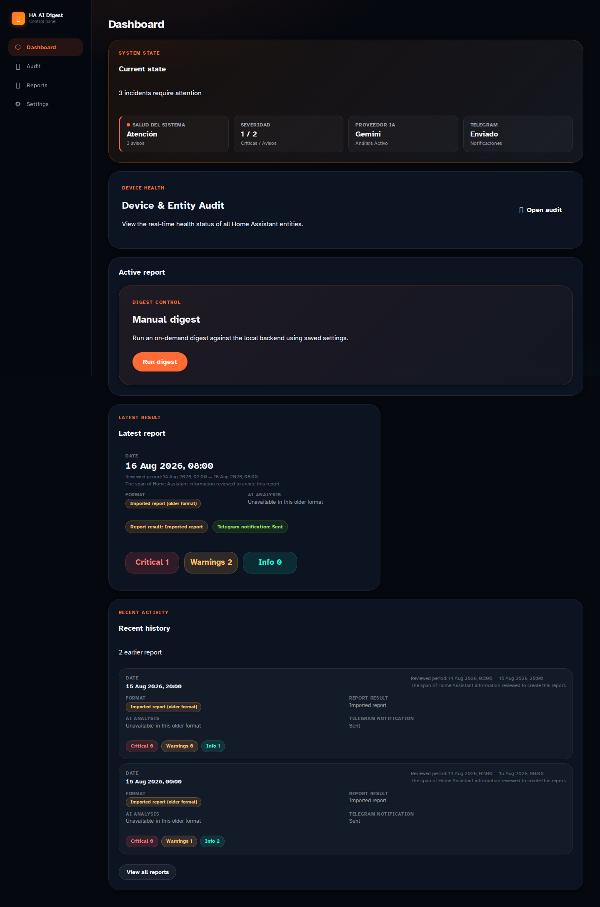
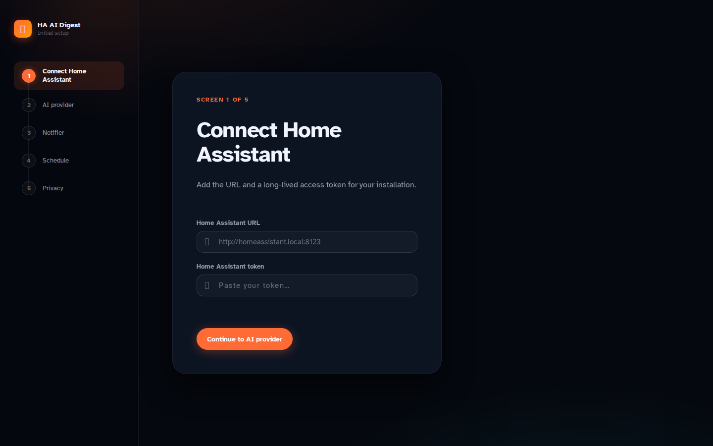
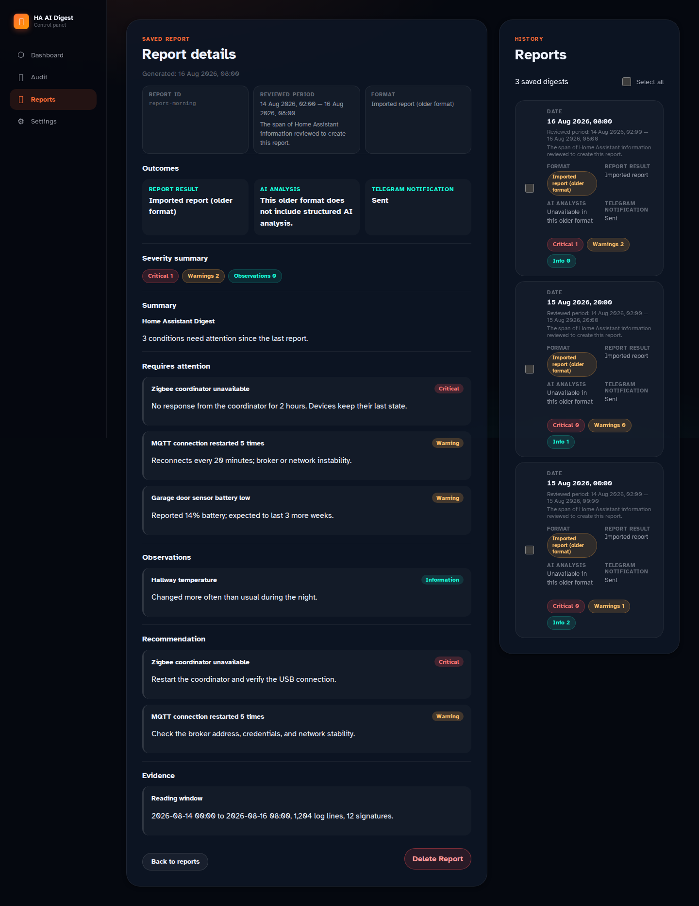
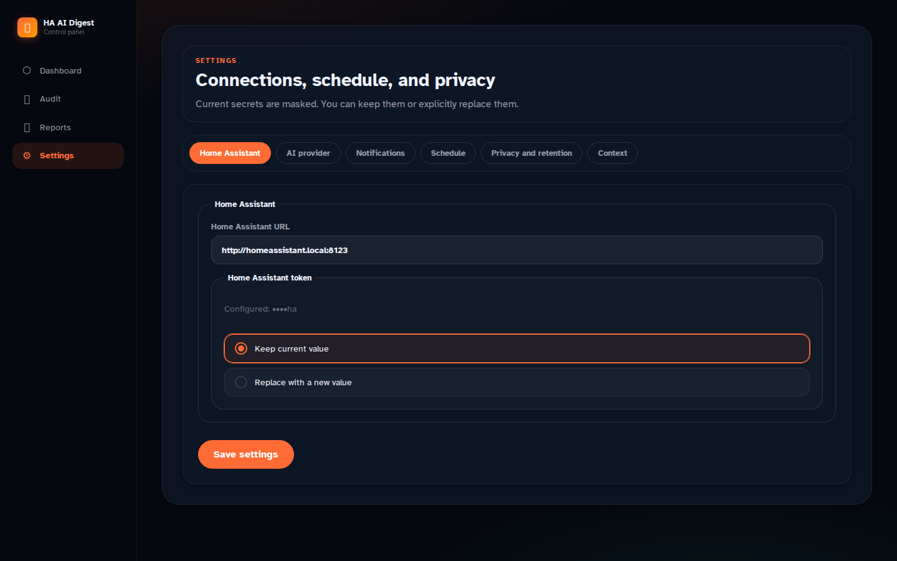

# 🏠 Home Assistant AI Digest Tool

> Turn Home Assistant Core log incidents into structured, actionable reports — automatically, on a schedule, with AI summaries and Telegram alerts.

[](https://github.com/ciltocruz/home-assistant-ai-digest-tool/actions/workflows/ci.yml)

Home Assistant AI Digest Tool is a **Docker-first web application** that watches one mounted `home-assistant.log` file, groups repeated errors into stable signatures, and produces a digest of what actually needs your attention — new problems, reactivated ones, and trends — enriched with Home Assistant integration status and optional AI analysis.



## ✨ What it does

- 📖 **Reads one narrow, read-only log mount** — never log rotations, never a full HA configuration directory.
- 🧠 **Remembers error signatures forever** — identifies new, recurring, reactivated, and latent errors instead of spamming you with duplicates.
- 🤫 **Learns a silent baseline** on first run, bounded by the history in the current log file.
- 🤖 **Analyzes with OpenAI, Gemini, or Ollama** through interchangeable adapters; context is redacted and bounded per signature.
- 📅 **Runs on your schedule** (daily, weekly, or custom) with timezone-aware, DST-safe slots — no default interval.
- 🔔 **Sends a compact Telegram summary** only when findings are noteworthy. Quiet runs stay quiet.
- 📊 **Tracks integration status** via the Home Assistant WebSocket API; an unavailable API shows as unavailable without discarding the report.
- 🔒 **Keeps everything local** — SQLite storage, encrypted secrets, no telemetry, no cloud account.

## 🚫 What it does NOT do

- ❌ **Not for Home Assistant OS, Supervised, or add-ons** — the supported deployment is a standalone container beside **Home Assistant Core running in Docker**.
- ❌ **Never mounts `/config`, the HA database, the Docker socket, or broad host paths.**
- ❌ **No full-log analysis** — only the current log file from a persisted byte cursor; rotation files are never read.
- ❌ **No silent failures** — a complete AI failure records in the web UI without advancing the log cursor, and tool failures never send a misleading Telegram message.
- ❌ **No bootstrap credentials** — the web UI is protected by an admin account created during onboarding; there are no tokens in Compose or `.env`.

## 🚀 Quick start

### Requirements

- Docker Engine with Docker Compose.
- Home Assistant Core running in Docker **on the same host**.
- One readable `home-assistant.log` file on that host.

### Run it

```bash
cp .env.example .env
# Set HA_LOG_FILE to the host path of home-assistant.log.
docker compose up --build --detach
```

Open **http://127.0.0.1:3000** and follow the guided onboarding.

Set `PUBLIC_APP_URL` only when the application has a stable browser-accessible origin (for example `https://digest.example/`). It must not include a path prefix, credentials, a query string, or a fragment; invalid values are ignored and Telegram summaries remain unlinked.

## Six-screen onboarding

The first browser visit selects a language and creates the admin account, then resumes the protected onboarding flow:

1. Home Assistant URL and long-lived access token.
2. OpenAI, Gemini, or Ollama provider configuration.
3. Optional Telegram bot token and chat ID.
4. Required schedule and timezone.
5. Privacy level and report retention.
6. An immediate first report.

Secrets are encrypted in `/data`, returned only as masks, and must never be committed, logged, or pasted into support requests. There are no bootstrap credentials in Compose or `.env`.



## 📋 What a report looks like

Reports rank findings into **attention items** (before observations and positive status), backed by recommendations and evidence.



The dashboard shows the current state, the latest report, and history at a glance:



## Report job lifecycle

Every launch — scheduled, manual, or the first report after onboarding — is a **durable report job** that survives restarts: it is queued, runs (collecting log data and analyzing signatures), and finishes as completed or failed. A failed job keeps its error and offers a retry; a complete AI failure records in the web UI without advancing the log cursor. Reports are retained locally (newest 10 by default) while error signatures stay permanent.

## 🧰 Configuration

Settings are editable after setup: Home Assistant connection, AI provider, Telegram target (with test-send), schedule, privacy level, report retention, password, ignored signatures, and operator notes. Masked secrets are preserved unless you explicitly replace them.

See [Configuration and integration status](docs/configuration.md) and [Docker Runtime Operations](docs/operations/docker-runtime.md) for providers, privacy, cost controls, backup, restore, and rollback.

## 📦 Release-based deployment

Deployments always point to a **release tag**, never to a branch or ad-hoc commit:

1. Create a release in the repository (for example `v1.0.0`).
2. Transfer the release source to the deployment host and set the image tag in `compose.yaml` to the release version.
3. Build and start from that release source only: `docker compose up --build --detach`.

Roll back by redeploying the previous release — the image tag and the deployed source always carry the same release version.

For TLS behind a controlled reverse proxy:

```bash
docker compose -f compose.yaml -f compose.reverse-proxy.yaml up --build --detach
```

The override enables trusted proxy headers and Secure cookies while the application port stays loopback-only.

## ✅ Verification

```bash
pnpm run ci          # typecheck + unit tests + focused checks + smoke tests + build
pnpm verify:docker   # isolated Compose verification with fake provider/HA
```

The Docker verifier creates disposable local and reverse-proxy Compose projects, tests readiness and persistence, and removes its resources on exit. It never needs your production credentials.

## 🔒 Security and data handling

- Keep the complete `/data` volume private: it holds SQLite data, the encryption key, encrypted credential records, and runtime logs.
- Back up `app.db` and `app.key` **together** — neither can restore encrypted settings alone.
- Use a dedicated Home Assistant long-lived token with only the required scope.
- AI costs scale with the number of error signatures analyzed and schedule frequency — review provider pricing and pick a privacy level before enabling a production API key.

## 💻 Development

Use **pnpm** only:

```bash
pnpm install
pnpm run ci
```

Regenerate README screenshots with `pnpm screenshots` (Playwright against the mocked runtime API — no backend, no credentials needed).

This is a clean-room implementation inspired by the product shape of Home Assistant incident digests; it is not a fork.